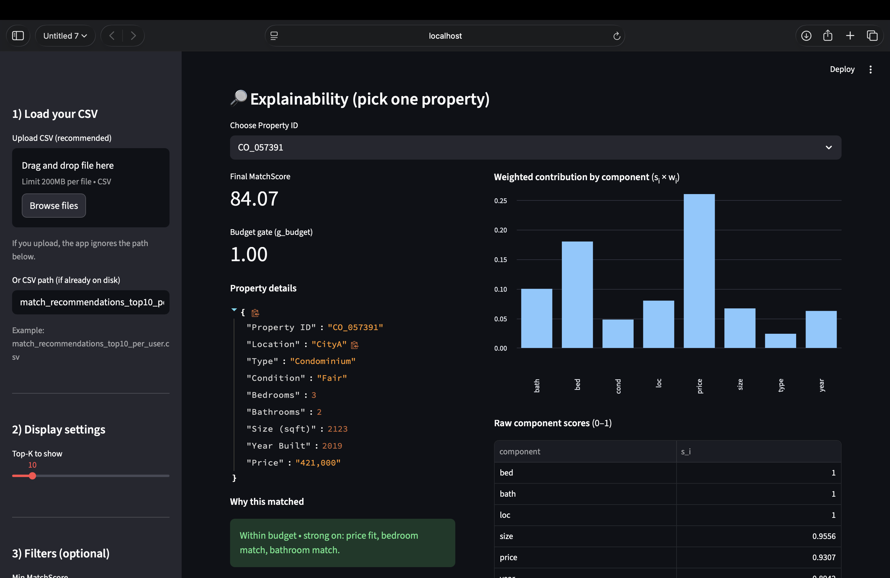

# 🏡 Property Match Recommender System

An end-to-end, explainable **property–user matching system** built as part of a data science assignment.  
The project computes a **Match Score** between users and properties and presents ranked recommendations through an **interactive Streamlit web interface**.

This repository demonstrates **problem understanding, feature engineering, scoring logic, explainability, and UI development** in a single coherent system.

---

## 📌 Problem Statement

Given:
- A **user preferences dataset** (budget, preferred location, property type, size, etc.)
- A **property dataset** (price, size, bedrooms, bathrooms, condition, year built, etc.)

The objective is to:
1. Design a **quantitative match-score function**
2. Rank properties for each user based on this score
3. Provide **transparent explanations** for why a property matches a user
4. Present results in a **clear and usable UI**

---

## 📂 Datasets Used

### 1️⃣ Property Dataset
Contains structured attributes for each property, such as:
- Price
- Location
- Property type
- Bedrooms and bathrooms
- Size (sqft)
- Year built / condition

### 2️⃣ User Preference Dataset
Contains structured preferences for each user, such as:
- Budget
- Preferred location
- Desired property type
- Size and bedroom requirements

These datasets are processed offline to generate a **recommendation CSV** used by the UI.

---

## 🧠 Methodology & Match Score Design

For every **user–property pair**, multiple compatibility components are computed:

- **Budget Fit** – how close the property price is to the user’s budget
- **Location Match** – alignment with preferred location
- **Size Match** – alignment with desired property size
- **Bedroom Match** – match with bedroom requirement
- **Condition Match** – alignment with property age/condition

Each component is normalized to the range `[0, 1]`.

### Final Match Score
The final score is a weighted combination:


This design was chosen because it is:
- Deterministic and interpretable
- Easy to debug and explain
- Suitable for real-world recommendation systems

---

## 🔍 Explainability

Every recommendation includes a **“Why this matched”** explanation, generated from the dominant score components.

This ensures:
- Transparency
- Trustworthiness
- Clear reasoning behind rankings

---

## 🖥️ Streamlit Web Interface

The Streamlit application provides:

### UI Features
- User selection (User ID)
- Top-K recommendations per user
- Sorting and filtering options
- Summary metrics (top score, average score)
- Clear tabular view of properties
- Explainable text for each recommendation

### UI Preview


---

## 📁 Repository Structure


---

## 🚀 How to Run the Project Locally

### 🔧 Prerequisites
- Python 3.9 or higher
- Git installed
- Internet connection (for installing packages)

---

## 🖥️ macOS / Linux

```bash
# Clone the repository
git clone https://github.com/chouhanpreeti302-png/Property-match-recommender.git
cd Property-match-recommender

# Create virtual environment
python3 -m venv .venv

# Activate virtual environment
source .venv/bin/activate

# Install dependencies
pip install -r requirements.txt

# Run Streamlit app
streamlit run streamlit_app.py
```
## 🖥️ Windows

```bash
# Clone the repository
git clone https://github.com/chouhanpreeti302-png/Property-match-recommender.git
cd Property-match-recommender

# Create virtual environment
python -m venv .venv

# Activate virtual environment
.\.venv\Scripts\Activate.ps1

# Install dependencies
pip install -r requirements.txt

# Run Streamlit app
streamlit run streamlit_app.py
